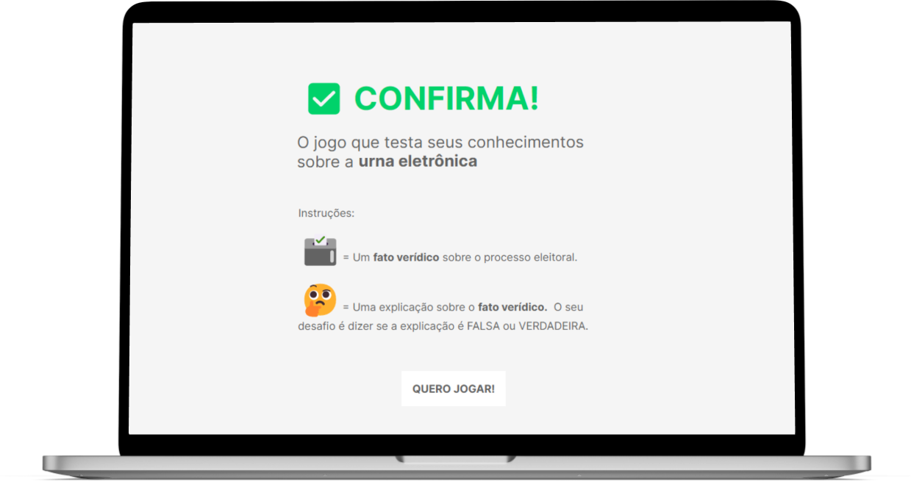

📷 David Traña | Unsplash

# NA LEVADA DAS ELEIÇÕES 

🤔 O que acontece quando três formatos narrativos - um quiz, uma página com filtros exploráveis e um scrollytelling - são colocados dentro de um mesmo repositório? Eles geram o **Na levada das eleições**, um portfólio de páginas web que abordam aspectos do processo eleitoral brasileiro. O propósito aqui foi utilizar linguagem de programação, dados e informações jornalísticas para experimentar diferentes maneiras de produzir conteúdo sobre as eleições. 

Os projetos que você irá encontrar nesse repositório não possuem um fio narrativo que conecte um ao outro. A experiência aqui é análoga à de um parque de diversões 🎡. A gente sabe que apesar de o barco Viking, o carrinho de Bate-bate e o estande de Tiro Ao Alvo fazerem parte de um mesmo universo, eles não possuem conexão entre si. Aliás, cada brinquedo tem uma mágica própria, assim como as páginas web que você vai explorar a seguir. 

Elas, definitivamente, não atingiram um grau de desenvolvimento suficiente para serem entregues a um usuário final. Mas elas, certamente, conseguem cumprir um propósito notável: trazer à tona o tema das eleições de uma maneira leve e descontraída. Em tempos de desinformação escancarada, de ameaças à democracia e de extremismos políticos, conteúdos sobre o processo eleitoral podem ser angustiantes. **Na levada das eleições** propicia um perambular despreocupado por esse universo e anseia que o passeio instigue curiosidades, seja fonte de críticas e de inspirações e, principalmente, desperte no público o interesse de compreender a fundo o processo de escolha dos representantes do povo. 

Sem mais delongas, chegou a hora de você conhecer em detalhes aspectos das eleições brasileiras! O único frio na barriga que você deve sentir aqui é o de empolgação, igual ao de quem está prestes a despencar do ápice de uma montanha-russa 🎢. Travas de segurança apertadas, o passeio começou.

# ATRAÇÃO 1: 🗳️Confirma | Quiz da Urna Eletrônica

Que tal praticar como será no dia da votação? Esse quiz reproduz uma urna eletrônica e testa seus conhecimentos sobre o processo eleitoral.

O jogo é simples: **você precisa dizer se uma explicação para um fato é verdadeira ou falsa**. 

Por exemplo: 

🗳️ FATO: A água do mar é salgada. 

🤔 EXPLICAÇÃO: *A água do mar é salgada porque há 547 anos uma esquadra de 10 mil caravelas espanholas que transportava sal grosso do Oriente afundou durante uma tempestade no oceano Atlântico, mudando, em definitivo, a composição química da água*. 

Essa explicação é falsa ou verdadeira? Nessa hora, a urna eletrônica entra em ação. Se a explicação for verdadeira, o jogador terá que votar 1. Caso contrário, votará 2. Ao clicar em CONFIRMA a resposta será registrada e o jogador poderá ir para a pergunta seguinte.

No momento, o jogo possui três perguntas (em tempo, nenhuma delas sobre a salinidade do mar). Que tal colocar seus conhecimentos à prova antes de seguir para a próxima atração? [QUERO JOGAR!](https://talitaburbulhan.github.io/na-levada-das-eleicoes/Confirma_Quiz-da-urna-eletronica) 

### 👀 Para ter em vista   

Algumas melhorias que poderiam ser futuramente desenvolvidas no quiz: 
* Elaborar mais perguntas;
* Criar uma página final com um contador, que mostre para o jogador a pontuação final; 
* Reproduzir o visual da urna utilizando HTML e CSS, ao invés de usar uma imagem SVG. Isso tornaria a interação com os botões (1, 2 e Confirma) mais fácil de lidar via javascript;
* Reduzir a intensidade do som dos botões da urna. 

# ATRAÇÃO 2: 🔽 Panorama Eleitoral | Filtrando candidatos/as/es

558.320 pessoas concorreram nas eleições municipais de 2020. 

* 👩🏾👩🏼‍🦳👩‍🦲 Quantas delas eram do gênero feminino?
* 👩🏾 Quantas eram do gênero feminino e tinham entre 18 e 30 anos?
* 👨🏿‍⚕️ Quantas eram do gênero masculino, da raça preta e com ensino superior completo?

O Panorama Eleitoral tem as respostas! 

* 👩🏾👩🏼‍🦳👩‍ 187.157 
* 👩🏾 17.455
* 👨🏿‍⚕️ 6.361

Explore a ferramenta que informa a quantidade de pessoas candidatas a partir de características como gênero, escolaridade, faixa etária, estado civil e raça, e mostra o percentual em comparação com o total. [QUERO FILTRAR!](https://talitaburbulhan.github.io/na-levada-das-eleicoes/Panorama-eleitoral)

### 👀 Para ter em vista

Algumas melhorias que poderiam ser futuramente desenvolvidas na página de filtros exploráveis: 
* Extrair alguma revelação dos dados e abordar isso na introdução da página; 
* Criar uma animação de "carregando dados" enquanto a página está com opacidade;
* Colocar o percentual de pessoas eleitas;
* Criar uma visualização que faça um comparativo dos candidatos e quantos deles foram eleitos. 

# ATRAÇÃO 3: 🥊Urnas sob ataque! | Teste Público de Segurança

SIIIMMMMMM, as urnas eletrônicas já sofreram ataques 😱.

*"Então, isso prova que aquele vídeo de procedência duvidosa do tio do zap sobre as eleições não serem seguras é verdade!* 

NÃÃÃÃÕOOOO, muito pelo contrário. Desde 2009, as urnas e seus sistemas sofrem ataques deliberados para que a integridade dos programas e a estrutura física do equipamento sejam colocados à prova. Essa é uma das ações de checagem da lisura das eleições, feitas pelo Tribunal Superior Eleitoral (TSE). Ela recebe o nome de Teste Público de Segurança, vulgo TPS. 

🗓️ A 6ª edição do TPS ocorreu em 2021. De 22/11 a 26/11, as pessoas e organizações inscritas realizaram ataques a componentes internos e externos da urna e do sistema eletrônico. Esses cinco dias de exame minucioso foram o momento auge de um processo que, na verdade, se extendeu por 112 dias, tendo iniciado no dia 26 de agosto de 2021, com as pré-inscrições dos interessados em participar, e sendo finalizado em 15 de dezembro de 2021, com a divulgação de relatório da Comissão Avaliadora do TSE.

Entender cada etapa do Teste Público de Segurança e encontrar resposta para perguntas do tipo, "Como foram selecionados os participantes?" e "Que ataque cada um realizou?" está, literalmente, na ponta do dedo: basta scrollar a tela. 📽️ Veja como:

https://user-images.githubusercontent.com/89229665/180100129-5812c68c-8178-44a3-a540-2d2ba6bf5219.mp4

👆🏼[QUERO SCROLLAR!](https://talitaburbulhan.github.io/na-levada-das-eleicoes/TPS_teste-publico-seguranca/) 

### 👀 Para ter em vista:   

Algumas melhorias que poderiam ser futuramente desenvolvidas no scrollytelling: 
* Fazer uma apuração mais robusta e plural, trazendo outras fontes - além Tribunal Superior Eleitoral (TSE) - que abordem o tema;
* Melhorar a experiência do usuário, travando o scroll em determinados pontos da página (Referência: https://triangulo.dev/posts/scroll-snap-na-pratica);

# Fim de percurso
https://user-images.githubusercontent.com/89229665/180330589-743d1ca2-442f-4298-b6ad-f164b425b212.mp4
📽️ [Scott Schaffer!](https://www.youtube.com/watch?v=KTji1hOICEI)

**Na levada das eleições** fica por aqui, muito obrigada pela visita! Esse repositório está aberto a contribuições e sugestões de melhorias. Ele foi criado como trabalho final do *Master de Jornalismo de Dados, Automação e Data Storytelling*, do Insper, turma 2021. Os projetos não teriam saído do plano das ideias e caído na internet sem a orientação de .

💖 Um agradecimento especial a todos os colegas de turma e ao corpo docente do curso. Foi uma jornada incrivelmente desafiadora. Que venham outras.    

